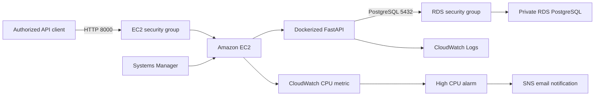
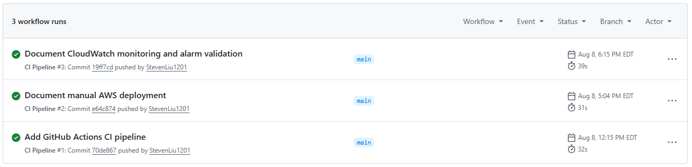
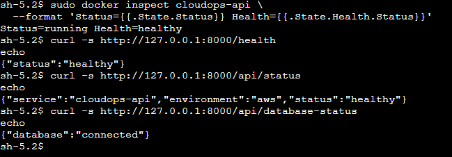
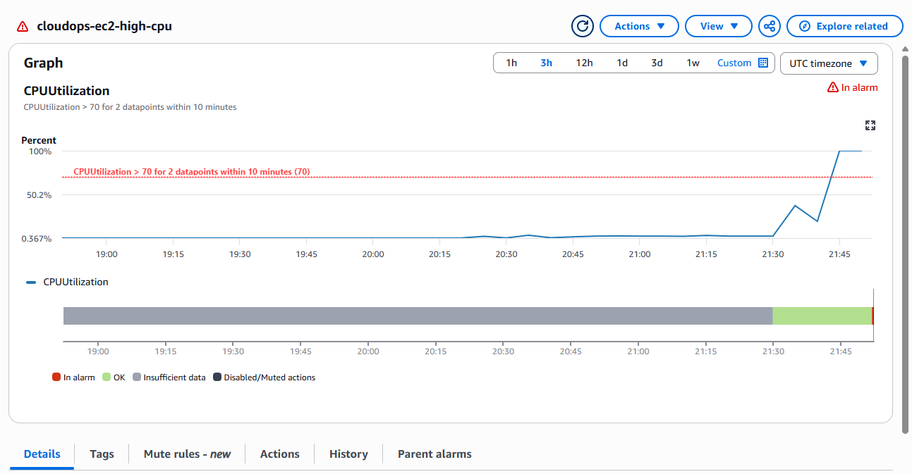
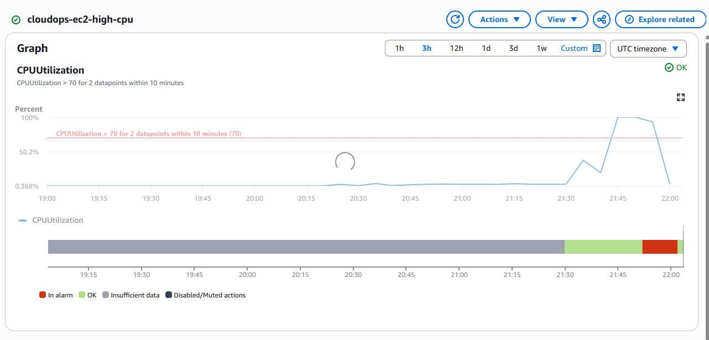

# CloudOps Status Platform

[](https://github.com/StevenLiu1201/cloudops-status-platform/actions/workflows/ci.yml)

CloudOps Status Platform is a small FastAPI service I built to practise the full path from local development to a working AWS deployment. The API itself is intentionally simple; the main focus of the project is Docker, continuous integration, AWS networking, database access, IAM, logging, monitoring, and operational verification.

The current AWS deployment runs the API in Docker on Amazon EC2 and connects it to a private Amazon RDS PostgreSQL database. I created the infrastructure manually first so I could understand and test each network and security relationship before reproducing it with Terraform.

## Architecture



The EC2 instance is in a public subnet, but access to the API is restricted by source IP. The database is in private subnets and accepts PostgreSQL traffic only from the EC2 security group. I administer the instance through AWS Systems Manager Session Manager, so the EC2 security group does not expose SSH port 22.

## What is implemented

- FastAPI endpoints for service health, status, version, and database connectivity
- PostgreSQL persistence through SQLAlchemy and Psycopg
- A non-root Docker image with an application health check
- Docker Compose for local API and PostgreSQL development
- Automated endpoint tests with pytest
- GitHub Actions CI for tests and Docker image builds
- A custom AWS VPC with public and private subnets across two Availability Zones
- Amazon EC2 for the API and private Amazon RDS for PostgreSQL
- IAM roles and Systems Manager Session Manager for keyless EC2 administration
- CloudWatch Logs for container output with seven-day retention
- A CloudWatch CPU alarm connected to an Amazon SNS email notification

Terraform and automated AWS deployment are not part of the current implementation.

## API endpoints

| Method | Endpoint | Purpose |
| --- | --- | --- |
| `GET` | `/health` | Confirms that the API process is responding |
| `GET` | `/api/status` | Returns the service name, environment, and status |
| `GET` | `/api/version` | Returns the configured application version |
| `GET` | `/api/database-status` | Runs a query to verify PostgreSQL connectivity |
| `GET` | `/docs` | Opens the interactive OpenAPI documentation |

## Run locally with Docker

### Prerequisites

- Docker Desktop with Docker Compose
- PowerShell for the commands below

Clone the repository and create the local configuration file:

```powershell
Copy-Item .env.example .env
```

Set a local database password in `.env`:

```text
POSTGRES_DB=cloudops_status
POSTGRES_USER=cloudops_app
POSTGRES_PASSWORD=choose_a_local_docker_password
```

Build and start the environment:

```powershell
docker compose up --build
```

Open <http://127.0.0.1:8000/docs>, or call the API directly:

```powershell
Invoke-RestMethod http://127.0.0.1:8000/health
Invoke-RestMethod http://127.0.0.1:8000/api/status
Invoke-RestMethod http://127.0.0.1:8000/api/version
Invoke-RestMethod http://127.0.0.1:8000/api/database-status
```

Run the test suite inside the API container:

```powershell
docker compose exec api python -m pytest backend/tests -v
```

Stop the environment while retaining the database volume:

```powershell
docker compose down
```

Docker Compose waits for PostgreSQL to become healthy before starting the API. The API entrypoint initializes the database schema and then starts Uvicorn. The named `postgres_data` volume keeps local database files when the containers are replaced.

## Project evidence

### Continuous integration

The GitHub Actions workflow runs the Python tests and builds the Docker image on pushes and pull requests to `main`.



### Runtime and database health

After deployment, the container health check reported `healthy`. The API health and status endpoints responded successfully, and `/api/database-status` confirmed the live connection to private RDS PostgreSQL.



### Alarm trigger and recovery

A bounded CPU load test produced two consecutive datapoints above the 70% threshold and moved the CloudWatch alarm into `ALARM`.



After the workload stopped and CloudWatch evaluated the next datapoint, the alarm returned to `OK`.



## AWS deployment record

I documented the AWS resources, manual deployment process, security decisions, cost controls, and operational commands in [docs/aws-manual-deployment.md](docs/aws-manual-deployment.md).

The deployment was verified by checking that:

- EC2 passed its status checks and Systems Manager connected without SSH or a key pair.
- The RDS endpoint resolved to a private `10.x.x.x` address from EC2.
- PostgreSQL port 5432 was reachable from EC2 through security-group-to-security-group access.
- The application authenticated with a restricted database role rather than the RDS master identity.
- The Docker container reported `running` and `healthy`.
- All API endpoints responded and `/api/database-status` confirmed the RDS connection.
- Docker, the container health check, and the database connection recovered after an EC2 reboot.
- FastAPI startup and request logs appeared in CloudWatch Logs.
- A controlled CPU test moved the CloudWatch alarm from `OK` to `ALARM`, sent an SNS email, and returned to `OK` after the load stopped.

## Problems I ran into

### Private subnet placement

I initially created both private subnets in the same Availability Zone. I caught the issue while checking the network configuration, deleted the second subnet, and recreated it in `ca-central-1b` before creating the RDS subnet group.

### Database credentials in the connection URL

The application password contained characters that needed to be encoded before being placed in the SQLAlchemy connection URL. I captured the password without echoing it in the terminal, URL-encoded it, stored the runtime configuration in a root-owned file on EC2, and removed the temporary shell variables.

### CloudWatch alarm timing

My first load test raised CPU to only about 50%, so the alarm correctly remained in `OK`. The alarm required two consecutive five-minute datapoints above 70%. I reviewed the graph and evaluation settings, ran a bounded workload long enough to produce two complete datapoints, and then verified the `OK` to `ALARM` to `OK` lifecycle.

The metric dropped before the alarm returned to `OK`. This was expected because CloudWatch metric ingestion and alarm evaluation are asynchronous.

## Security and cost choices

- RDS has no public access and its subnets have no internet route.
- The RDS security group accepts port 5432 only from the EC2 security group.
- EC2 uses Systems Manager instead of an SSH key pair or an inbound port 22 rule.
- IMDSv2 is required on the EC2 instance.
- The API runs as a non-root user inside its container.
- The deployed API authenticates with a non-administrative PostgreSQL role.
- Runtime credentials are excluded from Git and stored in a root-readable EC2 file.
- The EC2 logging policy is scoped to the `/cloudops/api` log group.
- The deployment avoids a NAT Gateway, load balancer, Elastic IP, RDS Proxy, and Multi-AZ database to control cost.
- CloudWatch logs expire after seven days, and an AWS Budget provides billing alerts.

## Current limitations and next steps

This is a portfolio-scale learning deployment rather than a production platform. It currently uses one EC2 instance, a Single-AZ database, source-IP-restricted HTTP on port 8000, manual deployment, and a root-readable environment file for runtime secrets.

The next improvements I would make are:

1. Reproduce the infrastructure with Terraform.
2. Add GitHub Actions deployment using AWS OpenID Connect instead of long-lived access keys.
3. Add HTTPS and a stable ingress layer.
4. Move runtime credentials to a managed secret service.

## Project structure

```text
.
|-- backend/
|   |-- app/                 # FastAPI, configuration, database, and model code
|   |-- tests/               # Automated API tests
|   |-- Dockerfile           # API image definition
|   |-- entrypoint.sh        # Schema initialization and Uvicorn startup
|   `-- requirements.txt     # Python dependencies
|-- docs/
|   |-- images/              # Sanitized project evidence
|   `-- aws-manual-deployment.md
|-- compose.yaml             # Local API, PostgreSQL, health checks, and volume
|-- .env.example             # Safe local configuration template
`-- README.md
```

The real `.env` file is excluded from Git and the Docker build context. Database passwords, AWS credentials, API keys, and tokens must not be committed.
