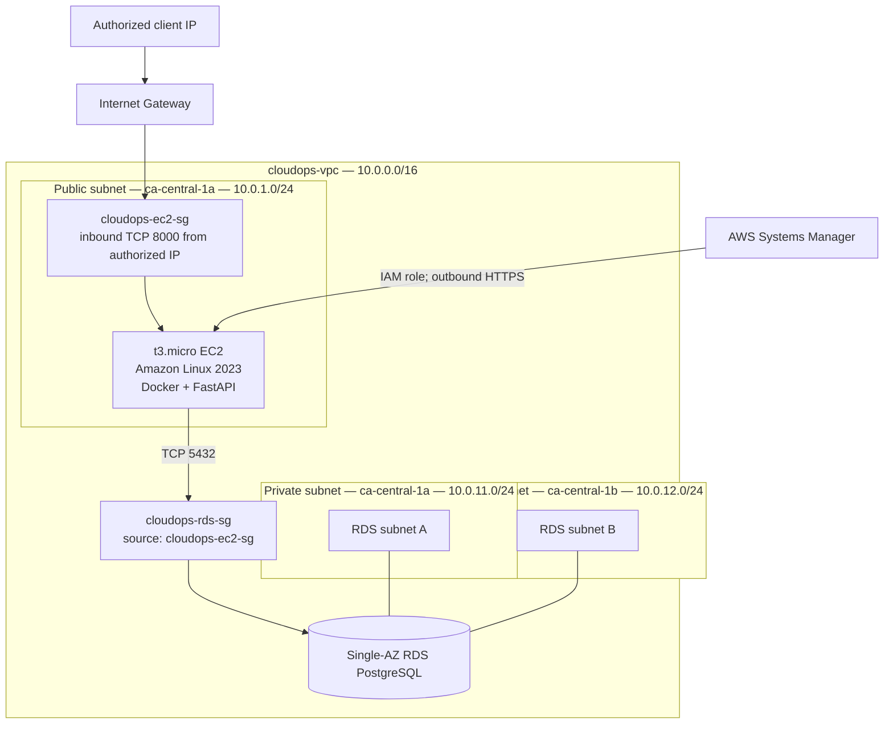

# Manual AWS Deployment

This document records the first working AWS deployment of CloudOps Status Platform. The infrastructure was created manually in the AWS Console before introducing Terraform so that each service and network relationship could be understood and verified.

## Implemented architecture



## AWS resources

| Resource | Purpose |
| --- | --- |
| `cloudops-vpc` | Isolated `10.0.0.0/16` project network |
| `cloudops-public-a` | Hosts the internet-facing EC2 instance |
| `cloudops-private-a` and `cloudops-private-b` | Provide private RDS placement across two Availability Zones |
| `cloudops-igw` | Internet route for the public subnet |
| `cloudops-public-rt` | Routes `0.0.0.0/0` to the Internet Gateway |
| `cloudops-private-rt` | Contains only the VPC-local route; no NAT Gateway |
| `cloudops-ec2-sg` | Permits API access on TCP 8000 from an authorized source IP |
| `cloudops-rds-sg` | Permits TCP 5432 only from `cloudops-ec2-sg` |
| `cloudops-ec2-role` | Grants the EC2 instance Systems Manager permissions |
| `cloudops-api-ec2` | Runs the Dockerized FastAPI application |
| `cloudops-db-subnet-group` | Restricts RDS placement to the private subnets |
| `cloudops-postgres` | Managed PostgreSQL database without public access |

## Security decisions

- Root and daily administrator identities use MFA.
- The EC2 instance has no SSH key pair and no inbound TCP 22 rule.
- Systems Manager provides IAM-authenticated administrative sessions.
- The EC2 instance requires IMDSv2.
- RDS has no public endpoint access and no internet route from its subnets.
- The RDS security group references the EC2 security group instead of an IP range.
- FastAPI authenticates as `cloudops_app`, a PostgreSQL role without administrative privileges.
- Database credentials are not committed to Git or copied into the Docker image.
- The EC2 runtime environment file is owned by root with mode `600`.
- The FastAPI process runs as the non-root `app` user inside its container.

## Deployment process

1. Create the VPC, subnets, Internet Gateway, and explicit route tables.
2. Create separate EC2 and RDS security groups.
3. Attach an EC2 IAM role containing `AmazonSSMManagedInstanceCore`.
4. Launch a `t3.micro` Amazon Linux 2023 instance in the public subnet.
5. Use Session Manager to install and enable Docker without opening SSH.
6. Create a private, Single-AZ RDS PostgreSQL instance using the two-subnet DB subnet group.
7. Connect from EC2 to RDS and create the non-administrative `cloudops_app` role.
8. Clone the GitHub repository and build `backend/Dockerfile` on EC2.
9. Store runtime variables in `/etc/cloudops-api.env` with root-only permissions.
10. Run the API container with a restart policy and publish TCP 8000.

The deployment intentionally does not use Docker Compose on EC2 because PostgreSQL is provided by RDS rather than a local database container.

## Verification performed

- EC2 reported all status checks passing.
- Systems Manager connected without SSH or a key pair.
- Docker was enabled at boot and ran a test container.
- The RDS endpoint resolved to a private `10.x.x.x` address from EC2.
- TCP 5432 was reachable from EC2 through security-group-to-security-group access.
- Both the RDS master identity and restricted application identity authenticated successfully.
- The API container reported `running` and `healthy`.
- `/health`, `/api/status`, `/api/version`, `/api/database-status`, and `/docs` were reachable through the EC2 public address from the authorized client IP.
- `/api/database-status` confirmed live connectivity to RDS.
- After an EC2 reboot, Docker, the API container, its health check, and the RDS connection recovered successfully.

## Operations

Inspect the application on EC2 through Session Manager:

```bash
sudo docker ps
sudo docker logs cloudops-api
sudo docker inspect cloudops-api \
  --format 'Status={{.State.Status}} Health={{.State.Health.Status}}'
curl -s http://127.0.0.1:8000/api/database-status
```

The container was started with `--restart unless-stopped`, and the Docker service was enabled with systemd. This provides restart recovery for a learning deployment; it is not a replacement for a production scheduler or Auto Scaling Group.

## Cost controls

- A monthly AWS Budget and email thresholds were configured before provisioning.
- The deployment uses one burstable EC2 instance and one Single-AZ burstable RDS instance.
- EC2 CPU credits use Standard mode to avoid unlimited-credit charges.
- RDS storage autoscaling, Multi-AZ, RDS Proxy, cross-Region backups, advanced Database Insights, and Enhanced Monitoring are disabled.
- No NAT Gateway, load balancer, Elastic IP, or customer-managed KMS key is used.
- RDS backup retention is limited to one day.
- EC2 and RDS deletion protection reduce accidental deletion but must be disabled during intentional cleanup.

Budgets are alerts rather than hard spending limits, and AWS billing data can be delayed. Running resources must still be reviewed and stopped or removed when they are no longer needed.

## Current limitations

- Ingress is plain HTTP on port 8000 and is restricted to a known source IP.
- The EC2 public IPv4 address can change after a stop/start cycle.
- The deployment is manual and currently runs a single EC2 instance and Single-AZ database.
- Runtime secrets use a root-readable EC2 file rather than a managed secret service.
- Application logs are local to the container and are not yet centralized.
- CI validates tests and the Docker build but does not deploy to AWS.

Planned improvements include HTTPS, CloudWatch logs and alarms, GitHub Actions CD using AWS OpenID Connect, managed secrets, and reproducible Terraform infrastructure.
